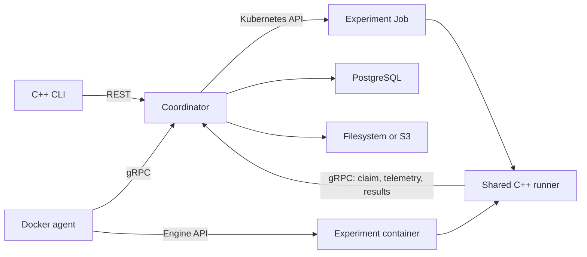

# Runyard

Runyard runs containerized experiments on Docker workers or Kubernetes Jobs.
It keeps each run's configuration, image digest, attempt history, and output.
The backend is written in C++20 for one trusted owner, with a C++ CLI.

The backend handles scheduling, leases, retries, cancellation, and parameter
sweeps. It includes NVIDIA GPU allocation, filesystem/S3 storage, monitoring,
and AWS infrastructure definitions.



Each deployment uses Docker or Kubernetes. PostgreSQL stores assignments,
leases, and results for both.

| Area | Technologies |
|---|---|
| Services | C++20, Drogon, gRPC/Protobuf, CLI11 |
| Persistence and integration | PostgreSQL/libpqxx, libcurl, AWS SDK for C++ |
| Execution | Docker Engine API, Kubernetes Jobs, NVML GPU discovery, shared Linux process supervisor |
| Operations | spdlog, prometheus-cpp, Prometheus, Grafana |
| Engineering | CMake, Ninja, vcpkg, GoogleTest, GitHub Actions |
| Deployment | Compose, kind, Terraform, AWS definitions |

## Local Docker quickstart

Requires Docker Engine 25+ or Docker Desktop, Compose v2, Bash, Python 3,
Git, and OpenSSL. Containers support Linux arm64 and amd64. The first build takes
a while, mostly because of gRPC; later builds reuse the cache. Leave enough VM
memory for PostgreSQL, the coordinator, and your experiments.

```bash
scripts/dev-setup.sh
scripts/build-images.sh
docker compose up -d
export RUNYARD_FIXTURE_IMAGE="$(scripts/publish-fixture.sh)"
python3 scripts/fixture-spec.py "$RUNYARD_FIXTURE_IMAGE" > .local/fixture.json
scripts/runyard-local.sh submit .local/fixture.json
```

The command prints a run ID and a request key. Substitute the returned run ID:

```bash
scripts/runyard-local.sh runs get RUN_ID --attempts
scripts/runyard-local.sh logs RUN_ID --follow
scripts/runyard-local.sh metrics RUN_ID --format csv
scripts/runyard-local.sh artifacts list RUN_ID
scripts/runyard-local.sh artifacts download ARTIFACT_ID --output .local/result.json
```

`runyard-local.sh` runs the C++ CLI in a container using the owner key. The native
CLI has the same commands. Set `RUNYARD_URL`, `RUNYARD_OWNER_TOKEN`, and
`RUNYARD_TLS_CA` as needed. Plaintext requires `RUNYARD_PROFILE=development`.
Use `--json` for machine-readable output. Keep the credentials in `.env` private.

The three local workers share one Docker engine and each advertise 1 CPU and
1 GiB of memory. HTTP uses localhost:8080 and gRPC uses localhost:9090.
PostgreSQL stays inside the Compose network. A separate migration container runs
before the server starts.

## Experiment contract

Build from `runyard-runner-base:dev`, include your program and dependencies,
and push the image. Submit its digest with a command argument array, parameters,
resource limits, timeout, priority, and retry policy.

The experiment reads `RUNYARD_PARAMETERS_PATH`, appends metrics such as
`{"name":"loss","step":0,"value":0.25}` to `RUNYARD_METRICS_PATH`, and writes
files under `RUNYARD_OUTPUT_DIR`. No Runyard SDK is needed.
See [workload packaging](docs/WORKLOADS.md) and the [fixture](examples/fixture.cpp).

Infrastructure failures retry by default. Application failures and timeouts
require opt-in. Work can run more than once, but ownership and lease checks reject
stale results. Accepted cancellation is immediate; cleanup is tracked separately.
See [failure behavior](docs/FAILURES.md).

## Other workflows

- [CLI commands](docs/CLI.md) and [OpenAPI contract](api/openapi.yaml).
- [GPU execution and capacity](docs/GPU.md), with a [PyTorch training example](examples/gpu-training/README.md).
- [Local Kubernetes](docs/KUBERNETES.md), using `scripts/kind-setup.sh` after image builds.
- [Operations and troubleshooting](docs/OPERATIONS.md).
- [Prometheus/Grafana](docs/OBSERVABILITY.md) and [storage](docs/STORAGE.md).
- [AWS preparation](docs/AWS.md), with private EKS, RDS, S3, ECR, and scoped IAM.
- [Architecture](docs/ARCHITECTURE.md), [tests](docs/TESTING.md), and [benchmarks](benchmarks/README.md).

## Source development

Use CMake 3.25+, Ninja, a C++20 compiler, pkg-config, Autoconf/Automake,
Libtool, Bison, Flex, and the committed vcpkg baseline:

```bash
scripts/bootstrap-vcpkg.sh
export VCPKG_ROOT="$PWD/.deps/vcpkg"
cmake --preset vcpkg
cmake --build --preset vcpkg -j 3
ctest --preset vcpkg
```

Build only the CLI with `cmake --build --preset vcpkg --target runyard`.
On macOS, run the backend in Linux containers. Native backend builds support
local tests. The build includes warnings, formatting, static analysis, and
sanitizer configurations.

Domain logic, application services, SQL, transports, execution, storage, and
CLI code live in separate modules. Generated Protobuf files stay in the build tree.
