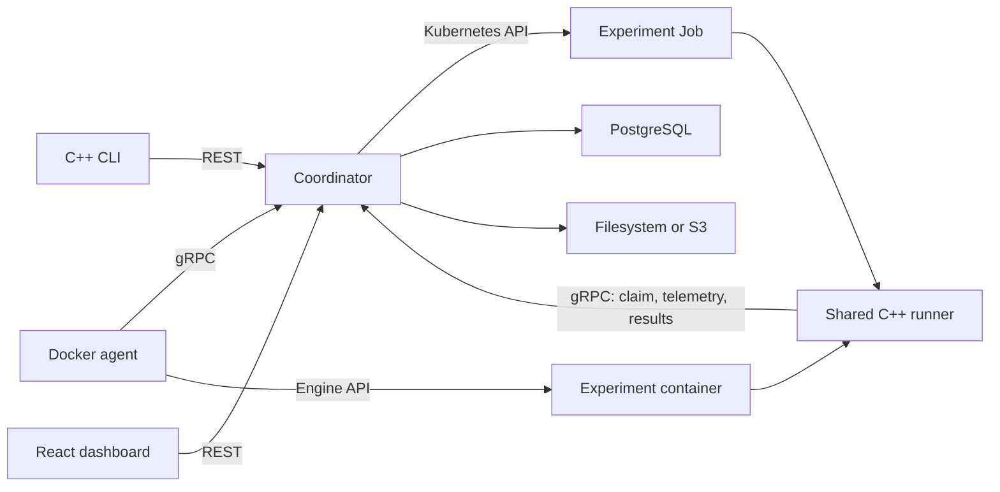

# Runyard

Runyard runs containerized experiments on Docker workers or Kubernetes Jobs.
It keeps each run's configuration, image digest, attempt history, and output.
The backend is written in C++20 for one trusted owner, with a React/TypeScript
dashboard and a C++ CLI.

The backend handles scheduling, leases, retries, cancellation, and parameter
sweeps. It includes NVIDIA GPU allocation, filesystem/S3 storage, monitoring,
and AWS infrastructure definitions.



Each deployment uses Docker or Kubernetes. PostgreSQL stores assignments,
leases, and results for both.

| Area | Technologies |
|---|---|
| Services | C++20, Drogon, gRPC/Protobuf, CLI11 |
| Dashboard | React, TypeScript, Vite, TanStack Query, Recharts, Playwright |
| Persistence and integration | PostgreSQL/libpqxx, libcurl, AWS SDK for C++ |
| Execution | Docker Engine API, Kubernetes Jobs, NVML GPU discovery, shared Linux process supervisor |
| Operations | spdlog, prometheus-cpp, Prometheus, Grafana |
| Engineering | CMake, Ninja, vcpkg, GoogleTest, GitHub Actions |
| Deployment | Compose, kind, Terraform, AWS definitions |

## Local Docker quickstart

Install Docker Desktop on macOS, or Docker Engine on Linux, with Compose 2.20+
and Python 3.9+. From a checkout:

```bash
./runyard up
```

Setup creates credentials, starts PostgreSQL, the coordinator, three workers,
and the dashboard, then runs an example. It checks logs, metrics, and the output
checksum, saving the result to `.local/install/result.json`. Repeating setup
keeps your data and reuses the example submission.

Open **http://127.0.0.1:3000**. Run `./runyard key` and paste the owner key into
**Connection settings**. The installer prints a direct link to the example run.

Setup reuses local images and builds missing ones with Docker. You do not need
C++ or Node installed. The first build takes a while; a published release allows
[installation from prebuilt images](docs/INSTALL.md#published-images).
Containers support Linux arm64 and amd64.

Useful commands:

```bash
./runyard doctor
./runyard status
./runyard logs server --follow
./runyard stop
./runyard up

# Use the run ID printed by setup:
./runyard cli runs get RUN_ID --attempts
./runyard cli logs RUN_ID --follow
```

`stop` keeps history and artifacts. Interrupted experiments may retry after
restart. `./runyard cli` runs the selected CLI image; `scripts/runyard-local.sh`
is an alias. Setup keeps existing credentials in the private, ignored `.env`.
Only `key` prints the owner key. The C++ client supports `--json`.

The three local workers share one Docker engine and each advertise 1 CPU and
1 GiB of memory. HTTP uses localhost:8080 and gRPC uses localhost:9090.
PostgreSQL stays inside the Compose network. A separate migration container runs
before the server starts. See the [install guide](docs/INSTALL.md) for
configuration and troubleshooting, and [connecting another worker](docs/WORKERS.md).

## Dashboard

With the local coordinator running:

```bash
cd ui
npm ci
npm run dev
```

Open `http://127.0.0.1:5180` to submit runs and sweeps, read logs, compare metrics,
download artifacts, and check capacity. The development proxy reads the owner key
from `.env`; the key stays out of browser assets. Requires Node.js 24.14+.

A packaged Nginx image is also available, from the repository root:

```bash
docker compose -f compose.yaml -f deploy/ui.compose.yaml up -d --build ui
```

Open `http://127.0.0.1:3000` and enter the owner API key in **Connection settings**.
See [dashboard operations and architecture](docs/UI.md) for authentication,
deployment, bounded telemetry, and verification commands.

## Experiment contract

Build from `runyard-runner-base:dev`, include your program and dependencies,
and push the image. Submit its digest with a command argument array, parameters,
resource limits, timeout, priority, and retry policy.

The experiment reads `RUNYARD_PARAMETERS_PATH`, appends metrics such as
`{"name":"loss","step":0,"value":0.25}` to `RUNYARD_METRICS_PATH`, and writes
files under `RUNYARD_OUTPUT_DIR`. No Runyard SDK is needed.
See [workload packaging](docs/WORKLOADS.md) and the [fixture](examples/fixture.cpp).

Infrastructure failures retry by default. Application failures and timeouts
require opt-in. Work can run more than once, but ownership and lease checks reject
stale results. Accepted cancellation is immediate; cleanup is tracked separately.
See [failure behavior](docs/FAILURES.md).

## Other workflows

- [CLI commands](docs/CLI.md) and [OpenAPI contract](api/openapi.yaml).
- [GPU execution and capacity](docs/GPU.md), with a [PyTorch training example](examples/gpu-training/README.md).
- [Local Kubernetes](docs/KUBERNETES.md), using `scripts/kind-setup.sh` after image builds.
- [Operations and troubleshooting](docs/OPERATIONS.md).
- [Prometheus/Grafana](docs/OBSERVABILITY.md) and [storage](docs/STORAGE.md).
- [AWS preparation](docs/AWS.md), with private EKS, RDS, S3, ECR, and scoped IAM.
- [Architecture](docs/ARCHITECTURE.md), [tests](docs/TESTING.md), and [benchmarks](benchmarks/README.md).

## Source development

Use CMake 3.25+, Ninja, a C++20 compiler, pkg-config, Autoconf/Automake,
Libtool, Bison, Flex, and the committed vcpkg baseline:

```bash
scripts/bootstrap-vcpkg.sh
export VCPKG_ROOT="$PWD/.deps/vcpkg"
cmake --preset vcpkg
cmake --build --preset vcpkg -j 3
ctest --preset vcpkg
```

Build only the CLI with `cmake --build --preset vcpkg --target runyard`.
On macOS, run the backend in Linux containers. Native backend builds support
local tests. The build includes warnings, formatting, static analysis, and
sanitizer configurations.

Domain logic, application services, SQL, transports, execution, storage, and
CLI code live in separate modules. Generated Protobuf files stay in the build tree.
